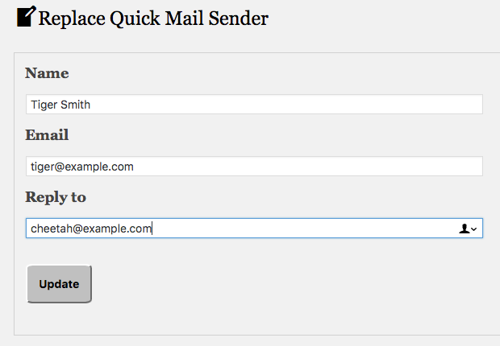

Replace Quick Mail Sender
====================

WordPress Plugin to replace user sender name and address in Quick Mail plugin.

Description
-----------

Implements filter for current user to replace their sending name and address.

Requires Administrator capabilities and [Quick Mail plugin](https://github.com/mitchelldmiller/quick-mail-wp-plugin) 3.2.0 or later.

__Features__

* Includes `replace_quick_mail_sender` filter, and form to change sending name and address with it. 

### Learn More

* See [Send Reliable Email from WordPress with Quick Mail](https://wheredidmybraingo.com/send-reliable-email-wordpress-quick-mail/).

### Installation ###

* Download [the latest release](https://github.com/mitchelldmiller/replace-quick-mail-sender/releases/latest) and unpack in your `/wp-content/plugins/` directory.

* Verify that Quick Mail plugin is activated.

* Activate the plugin through the WordPress 'Plugins' menu.

### Frequently Asked Questions ###

__Who can use this plugin?__

* User must be an Administrator. Site must have Quick Mail plugin active.

__How to Disable Filter__

* Delete name or email, to temporarily disable filter.

__Saves Credentials__

* Does not delete user info when plugin is uninstalled.

__Limitations__

* Check `From` name in Quick Mail, because other mail plugins can override sender credentials.

* Replacement name must be 1-80 characters.

* Replacement email address is verified if `Verify recipient email domains` is enabled.

__Translators and Programmers__

* A .pot file is included for translators.

__License__

This plugin is free for personal or commercial use. 
